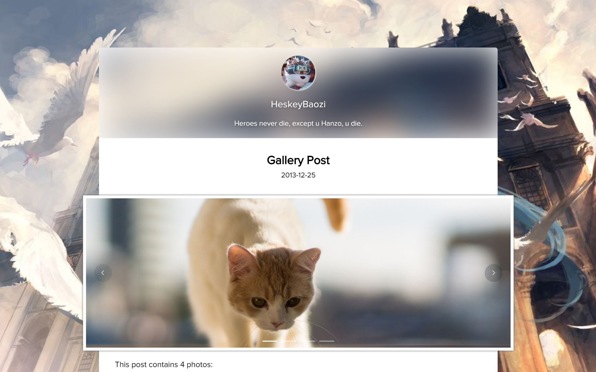
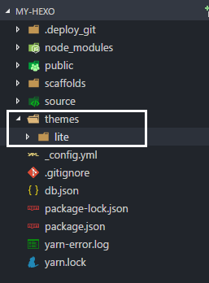

# Hexo Theme Lite

> Keep Calm, Lite and Writing.

light single page blog application theme, using Vue, Vuex, ElementUI and so on.


## Live Demo

[Demo | 在线演示](https://heskeybaozi.github.io/)

## Preview



## Get Started & Install

1. Enter to the `Hexo` root directory. The root directory must include `themes`, `node_modules`, `source` and so on.

```bash
cd my-hexo
ls
# output:
# _config.yml  node_modules  package.json  public  scaffolds  source  themes
```

2. Download the latest release by using `git clone`

```bash
git clone https://github.com/HeskeyBaozi/hexo-theme-lite themes/lite
```

after `git clone`, the result is like this:



3. Edit the `__config.yml` in your root directory.

modify the field `theme` into `lite`.

```yml
# Extensions
theme: lite
```

4. Generate static files
```bash
hexo g
```

5. Run `Hexo` server
```bash
hexo s

# output:
# INFO  Hexo is running at http://localhost:4000/. Press Ctrl+C to stop.
```

6. Enter your localhost link to preview the blog.


## Features

edit the `/themes/lite/__config.yml` to make it custom.

preview the [`/themes/lite/__config.yml`](https://github.com/HeskeyBaozi/hexo-theme-lite/blob/master/_config.yml) file.


## Development Build Setup

``` bash
# install dependencies
npm install # or yarn

# serve with hot reload at localhost:8080
npm run dev

# build for production with minification
npm run build

# build for production and view the bundle analyzer report
npm run build --report
```

[Development Server](https://github.com/HeskeyBaozi/lite-se)
