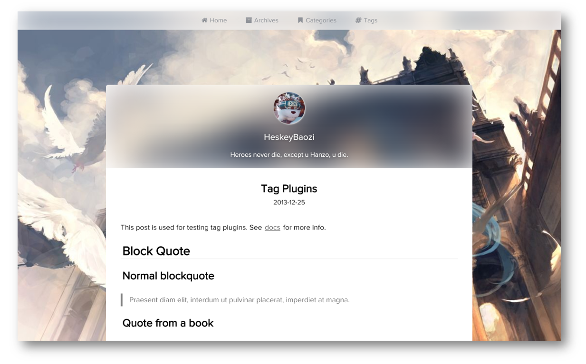

# Hexo Theme Lite

> Keep Calm, Lite and Writing.

light single page blog application theme, using Vue, Vuex, ElementUI and so on.

[](https://github.com/HeskeyBaozi/hexo-theme-lite/releases)
[]()

## Live Demo

[Demo | 在线演示](https://heskeybaozi.github.io/)

## Preview



## Get Started & Install

1. Download [the latest release](https://github.com/HeskeyBaozi/hexo-theme-lite/releases).

the release is generally named `Lite.zip`.

2. Enter to the `Hexo` root directory. The root directory must include `themes`, `node_modules`, `source` and so on.

```bash
$ cd my-hexo

$ ls
_config.yml  node_modules  package.json  public  scaffolds  source  themes
```

3. Decompress the downloaded `Lite.zip` to the `themes` folder


4. Edit the `__config.yml` in your root directory.

modify the field `theme` into `lite`.

```yml
# Extensions
theme: lite
```

## Features

edit the `/themes/lite/__config.yml` to make it custom.

```yml
# -------------------------------------------------------
# Custom Pictures
# -------------------------------------------------------

avatar:
  enable: true
  url: /static/images/kamuyi.jpg

background:
  url: /static/images/miku.jpg
  css_size: cover
  css_position: 50%


# -------------------------------------------------------
# Menu
# -------------------------------------------------------

menu:
  # Basic Menu
  Home: true
  Archives: true
  Categories: true
  Tags: true

  # Custom Menu
  # '/index' can be omitted
  # please add '/pages' as prefix
  # example:
  # [X]  About: /about/index       (need '/pages' as prefix)
  # [O]  About: /pages/about/index (preferred)
  # [O]  About: /pages/about

  # About: /pages/about/index

menu_icons:
  enable: true
  # icon name docs: http://fontawesome.io/icons/
  Home: fa-home
  Archives: fa-archive
  Categories: fa-bookmark
  Tags: fa-hashtag
  About: fa-smile-o

# -------------------------------------------------------
# Social
# -------------------------------------------------------

social:
  github: https://github.com/heskeybaozi
  # weibo: http://weibo.com/52hezhiyu

  # Email link, reference to https://developer.mozilla.org/en-US/docs/Learn/HTML/Introduction_to_HTML/Creating_hyperlinks#E-mail_links
  # email: mailto:hezhiyu233@foxmail.com


social_icons:
  enable: true
  # icon name docs: http://fontawesome.io/icons/
  github: fa-github-alt
  weibo: fa-weibo
  email: fa-envelope
  wechat: fa-weixin
  qq: fa-qq

# -------------------------------------------------------
# Page 404
# -------------------------------------------------------
page_404:
  # enable to use custom 404 page
  enable: false
  # filename of .md file path in your source dir
  # example:
  # after run command `hexo new page 404`
  # [X]  source_path: /404/index            (work dictionry is 'source')
  # [O]  source_path: 404/index.md
  # [O]  source_path: 404/index
  # [O]  source_path: 404                   ('/index' can be omitted)
  source_path: 404/index.md

# -------------------------------------------------------
# Powered by
# -------------------------------------------------------
powered_by: Hexo Theme Lite

```


## Development Build Setup

``` bash
# install dependencies
npm install # or yarn

# serve with hot reload at localhost:8080
npm run dev

# build for production with minification
npm run build

# build for production and view the bundle analyzer report
npm run build --report
```

[Development Server](https://github.com/HeskeyBaozi/lite-se)
