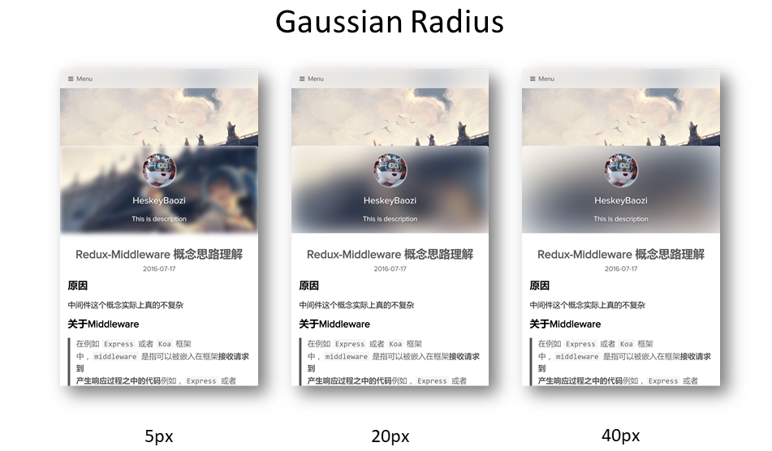
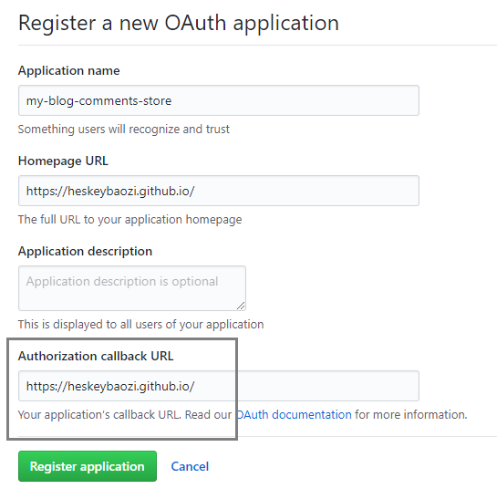

# Hexo Theme Lite

> Keep Calm, Lite and Writing.

light single page blog application theme, using `Vue`, `Vuex`, `ElementUI` and so on.

一款轻量单页博客主题，基于`Vue`, `Vuex` 和 `ElementUI` 构建


## Live Demo

[Demo | 在线演示](https://heskeybaozi.github.io/)

## Preview


## Get Started & Install

1. Enter to the `Hexo` root directory. The root directory must include `themes`, `node_modules`, `source` and so on.

首先进入`Hexo`根目录，请确保这个目录下有`themes`, `node_modules`, `source`等文件。

```bash
cd my-hexo
ls
# output:
# _config.yml  node_modules  package.json  public  scaffolds  source  themes
```

2. Download the latest release by using `git clone`

使用`git clone`命令下载最新的发布版本

```bash
git clone https://github.com/HeskeyBaozi/hexo-theme-lite themes/lite
```

after `git clone`, the result is like this:

使用命令后，结果看起来会是这样


3. Edit the `__config.yml` in your root directory.

modify the field `theme` into `lite`.

打开根目录的`__config.yml`文件，将`theme`字段设为`lite`

```yml
# Extensions
theme: lite
```

4. Generate static files
```bash
hexo g
```

5. Run `Hexo` server
```bash
hexo s

# output:
# INFO  Hexo is running at http://localhost:4000/. Press Ctrl+C to stop.
```

6. Enter your localhost link to preview the blog.


## Features

### Custom many things

- avatar | 头像

```yml
avatar:
  enable: true
  url: /static/images/kamuyi.jpg
```

- background picture | 背景图片

```yml
background:
  background_color: '#ffffff'

  # Custom Background Picture
  enable_picture: true
  url: /static/images/miku.jpg
  css_size: cover
  css_position: 50%
```

- top menu item | 顶部导航菜单项目设置

```yml
# Example

menu:
  # Basic Menu
  Home: true
  Archives: true
  Categories: false
  Tags: false

  # Custom Menu
  # 'About' link to the 'About' page if there exists '/about/index.md' in your 'source' dir.
  # 这里是一个导航到'关于我'的页面，前提是你需要在你的'source'文件夹有'/about/index.md'文件
  About: /pages/about/index
```
- theme filter blur | 主题模糊滤镜设置

you can set the gaussian radius here.

你可以在这里设置高斯模糊半径，效果如下.



```yml
blur:
  background_color: '#ffffff'

  # 'true' corresponding to css style 'overflow: hidden'
  # 设置为'true'则对应模糊容器'overflow'选项
  hide_overflow: true

  gaussian_radius: # 高斯模糊程度，数值越大越模糊
    top_navigator: 30 # 30+ preferred
    header: 30 # 5 ~ 50 preferred
    footer: 40 # 5 ~ 100 preferred

  font:
    color: '#ffffff'
```

Notice that the `font.color` will only affect the font color in the blur area.

注意，这里的`font.color`只会影响模糊区域的字体颜色.

- social links | 社交链接

```yml
social:
  github: https://github.com/heskeybaozi
  weibo: http://weibo.com/52hezhiyu

  # Email link
  email: mailto:hezhiyu233@foxmail.com

social_icons:
  enable: true

  # icon name docs: http://fontawesome.io/icons/
  github: fa-github-alt
  weibo: fa-weibo
  email: fa-envelope
  wechat: fa-weixin
  qq: fa-qq
```

- page 404 | 404 页面

```yml
page_404:
  # enable to use custom 404 page
  enable: false
  # filename of .md file path in your source dir
  source_path: 404/index.md
```

### Cool features

- Comments | 评论系统

We use `Gitment` for the comments system.

> What's [`Gitment`](https://github.com/imsun/gitment) ?

> Gitment is a comment system based on GitHub Issues, which can be used in the frontend without any server-side implementation.

> Gitment 是一个使用Github Issues页面来存储评论的无‘服务端’评论系统

[Click here](https://github.com/settings/applications/new) to register an OAuth application, and you will get a `client id` and a `client secret`.
Make sure the callback URL is right. Generally it's the origin of your site, like [`https://heskeybaozi.github.io/`](https://heskeybaozi.github.io/).

[点击这里](https://github.com/settings/applications/new)创建Github OAuth应用, 你就会得到`client id`和`client secret`。一定要确保回调url返回到你的主域名, 例如[`https://heskeybaozi.github.io/`](https://heskeybaozi.github.io/).



```yml
# https://github.com/imsun/gitment#customize
gitment:
  enable: false
  github_id: # your github id
  repository_name: # your repository name

  # client_id & secret will generated after register an OAuth App
  # reference: https://github.com/settings/applications/new
  client_id:
  client_secret:
  per_page: 8 # comments per page
  max_comment_height: 250 # default 250px
```

- Google Analytics | 谷歌分析

```yml
google_analytics:
  enable: false # remember to switch to 'true' when using google analytics

  # replace to your track_id. It starts with 'UA-'.
  # 这里替换为你的跟踪ID，记得打开`enable: true`
  track_id: UA-XXXXXX-X
```
## Other issues | 其他问题

- make sure you have installed `hexo-pagination`. 请确保你已经安装了`hexo-pagination`
```bash
npm install --save hexo-pagination # or yarn add hexo-pagination
```

- post's code rendered in one line ? | 文章里的代码都显示在一行？

make sure you have turned the `highlight` plugin on your root `__config.yml`

请确保你根目录下的`__config.yml`文件是打开`highlight`插件的

```yml
# example
highlight:
  enable: true
  line_number: true
  auto_detect: true
  tab_replace:
```

## How to upgrade this theme | 如何升级主题

- recommended method | 推荐做法

run the commands in your root hexo dir.

在根目录下跑这些命令

```bash
cd themes/lite

git pull
```

- other method | 其他暴力做法

就是重新删除主题文件夹再安装，记得保存`__config.yml`文件。

1. save your theme `__config.yml` file.

2. delete `/themes/lite` dir

3. enter your `hexo` root dir

4. run command

```bash
git clone https://github.com/HeskeyBaozi/hexo-theme-lite themes/lite
```

5. replace theme configure file by using your saved `__config.yml`

## Development Build Setup | 如何帮助我一起开发主题

[Development Server | 开发者用来debug的服务器](https://github.com/HeskeyBaozi/lite-se)
